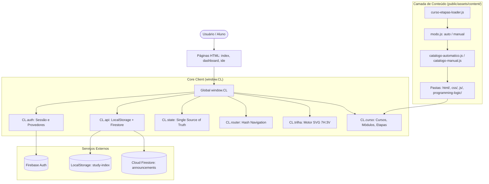

# 🗺️ Code Map & Guia de Arquitetura — Coding Loop

Este documento serve como mapa de código permanente, referência arquitetural e base de orientação para implementação de novas funcionalidades, correções, melhorias e manutenção no projeto **Coding Loop** (`Edition-Coding-Loop`).

---

## 1. Visão Geral e Filosofia Arquitetural

O **Coding Loop** é uma plataforma interativa de ensino de programação web (HTML, CSS, JavaScript, Lógica de Programação), estruturada como uma Single-Page / Multi-Entry Application estática, sem backend Node próprio, orientada a cliente (*Client-Side Rendering*).

### Pilares da Arquitetura:
1. **Hospedagem Estática (GitHub Pages)**:
   - O site em produção é gerado a partir da pasta `public/` e publicado via GitHub Actions (`.github/workflows/pages.yml`).
   - O repositório opera em subdiretório (ex.: `https://coding-loop.github.io/web.app/`), exigindo caminhos relativos em todos os assets e links.
2. **Arquitetura Local-First**:
   - O progresso do aluno (etapas concluídas, código salvo, pontuações, preferências de tema e posição atual na IDE) é salvo prioritariamente no **`localStorage`** do navegador (`study-index_<uid>`).
   - Não há dependência direta de banco de dados remoto para que o aluno estude. A portabilidade entre dispositivos ocorre via arquivos de exportação/backup (`private-backups/` ou integração com Drive/OneDrive).
3. **Serviços Firebase**:
   - **Firebase Authentication**: Login por e-mail/senha e provedores OAuth (Google, GitHub, etc.).
   - **Cloud Firestore**: Utilizado de forma restrita e segura:
     - Leitura pública de avisos/comunicados (`announcements`), gerenciados pelo painel `admin.html` (restrito a usuários com Custom Claim `admin: true`).
     - Regras estritas (`firestore.rules`) protegendo dados de usuários contra escritas não autorizadas.
4. **Namespace Global Único (`window.CL`)**:
   - Todo o estado e os subsistemas da plataforma se comunicam pelo objeto global `window.CL`:
     - `CL.config`: Configurações globais e imutáveis (`Object.freeze`).
     - `CL.state`: Fonte única da verdade (*Single Source of Truth*) para rotas, usuário, modais, tema.
     - `CL.auth`: Módulo de autenticação e escuta de sessão.
     - `CL.api`: Camada de abstração de dados (localStorage e Firestore).
     - `CL.router`: Hash router SPA do Dashboard.
     - `CL.curso`: Catálogo de cursos, módulos, etapas e helpers de cálculo de progresso.
     - `CL.trilha`: Motor gráfico para desenhar as fases no padrão geométrico 7H:3V e curva de Hilbert.
     - `CL.ui` / `CL.components`: Renderizadores visuais, modais, toasts e alertas.



---

## 2. Inventário Completo de Arquivos do Projeto (226 Arquivos)

Abaixo está o mapeamento de todos os arquivos organizados por função e módulo:

### 2.1 Raiz do Projeto (Configuração, Deploy e Regras)
| Arquivo | Descrição / Função |
| :--- | :--- |
| `.firebaserc` | Mapeamento do projeto Firebase padrão (`coding-loop`). |
| `.gitignore` | Lista de exclusões do Git (backups privados, logs, etc.). |
| `firebase.json` | Configuração principal do Firebase (regras do Firestore, índices e emuladores). |
| `firestore.indexes.json` | Definição de índices compostos do Firestore para ordenação de avisos. |
| `firestore-debug.log` | Log local de operações do Firestore Emulator. |
| `deploy-firebase.ps1` | Script raiz PowerShell para acionar o deploy de regras e índices. |
| `Para-Git-Push.txt` | Notas e orientações sobre publicação via Git. |

### 2.2 GitHub Workflows e IDE (`.github/`, `.vscode/`)
| Arquivo | Descrição / Função |
| :--- | :--- |
| `.github/workflows/pages.yml` | Pipeline de CI/CD do GitHub Actions: valida projeto, gera pacote e publica no GitHub Pages. |
| `.vscode/settings.json` | Preferências do editor de código do projeto. |

### 2.3 Instruções e Especificações (`Instruções/`)
| Arquivo | Descrição / Função |
| :--- | :--- |
| `Instruções/README.md` | Documentação técnica principal com guia de deploy, segurança e estrutura. |
| `Instruções/Code-Map.md` | Mapa completo de arquitetura e inventário do projeto. |
| `Instruções/CodeMapa.md` | Guia prático de seleção e roteamento de arquivos por tarefa. |
| `Instruções/Contexto.md` | Memória operacional, histórico e estado vivo do projeto (STATUS v5). |
| `Instruções/AGENTS.md` / `GEMINI.md` | Diretrizes de arquitetura para agentes e LLMs. |
| `Instruções/Carrossel da Área Coding Loop.md` | Manual de inclusão, remoção e customização de slides no carrossel do Dashboard. |
| `Instruções/Dados Firebase.md` | Dicionário de dados, coleções e matriz de permissões/operações do Firebase. |
| `Instruções/Especificacao-Trilha-Modulos-7H3V.md` | Especificação geométrica e matemática do traçado das trilhas SVG (Padrão 7H:3V). |

### 2.4 Backups Privados e Temporários (`private-backups/`, `tmp/`)
| Arquivo | Descrição / Função |
| :--- | :--- |
| `private-backups/coding-loop-progresso-2026-08-15-2329.json` | Snapshot de backup local do progresso de estudo (ignorado no deploy). |
| `tmp/pdfs/especificacao-trilha-v5-1.png` a `v5-4.png` | Imagens de diagramação e rascunhos visuais da especificação geométrica. |

### 2.5 Relatórios e Auditorias de Segurança (`reports/security/`)
| Arquivo | Descrição / Função |
| :--- | :--- |
| `reports/security/RELATORIO-CIBERSEGURANCA-2026-09-08.md` | Relatório detalhado da auditoria de segurança da informação e Firestore. |
| `reports/security/CORRECOES-2026-09-08.md` | Registro de correções efetuadas para blindagem de dados e regras. |
| `reports/security/verify-security.cjs` | Script executável Node.js para conferência automática das diretivas de segurança. |

### 2.6 Scripts de Automação e Empacotamento (`scripts/`)
| Arquivo | Descrição / Função |
| :--- | :--- |
| `scripts/build-pages.cjs` | Script de empacotamento: filtra arquivos sensíveis/desnecessários de `public/` para o deploy. |
| `scripts/deploy-firebase.ps1` | Executa validações e aciona o Firebase CLI com escopo seguro de regras e índices. |
| `scripts/extrair-svgs-embutidos.js` | Utilitário para extrair ícones inline do HTML/CSS para arquivos SVG dedicados. |
| `scripts/gerar-manifest-conteudo.ps1` | Varre a pasta `content/` e gera automaticamente o arquivo `catalogo-automatico.js`. |
| `scripts/verify-deploy.cjs` | Script de validação executado no CI/CD antes do deploy do GitHub Pages. |

---

### 2.7 Frontend Público (`public/`)

#### 2.7.1 Páginas HTML Principais
| Arquivo | Descrição / Função |
| :--- | :--- |
| `public/index.html` | Landing page pública, portal de boas-vindas e tela de login/cadastro e recuperação de senha. |
| `public/dashboard.html` | Painel do aluno protegido: carrossel de novidades, lista de cursos, estatísticas e menu de trilha. |
| `public/ide.html` | Ambiente de desenvolvimento interativo: Monaco Editor, divisão em painéis, testes, visualizador e guia de etapas. |
| `public/admin.html` | Painel de controle para administradores (criação e moderação de avisos globais no Firestore). |
| `public/politica-de-privacidade.html` | Página informativa de privacidade e uso de dados locais. |
| `public/404.html` | Página de erro amigável para rotas inexistentes no GitHub Pages. |
| `public/firebase.json` | Configuração residual da pasta pública. |
| `public/firestore.rules` | Cópia local de regras de segurança para testes. |
| `public/firestore-debug.log` | Registro de log do ambiente local. |

#### 2.7.2 Folhas de Estilo (`public/assets/css/`)
| Arquivo | Descrição / Função |
| :--- | :--- |
| `public/assets/css/global.css` | Design System: Variáveis CSS (Cores, Solarized Dark/Light), tipografia, botões, modais, toasts e resets. |
| `public/assets/css/dashboard.css` | Layout da dashboard: grid de cursos, cabeçalho retrátil, carrossel de destaques e painel de progresso. |
| `public/assets/css/trilha.css` | Estilos dos nós, caminhos SVG, círculos de progresso, estados bloqueados/concluídos da trilha de aprendizagem. |
| `public/assets/css/ide.css` | Layout do editor de código: split view (Monaco / Pré-visualização / Instruções), abas de arquivos e terminal/console. |
| `public/assets/css/admin.css` | Estilos da interface administrativa de avisos. |

#### 2.7.3 Scripts Core da Aplicação (`public/assets/js/`)
| Arquivo | Descrição / Responsabilidade |
| :--- | :--- |
| `public/assets/js/firebase-init.js` | Inicializa os SDKs do Firebase (Auth e Firestore) usando a configuração do projeto. |
| `public/assets/js/auth.js` | Gerenciador de autenticação: login, cadastro, logout, recuperação de senha, observador de sessão e guards. |
| `public/assets/js/api.js` | Camada de dados do aluno: lê/grava progresso e exercícios no `localStorage`, e consome avisos do Firestore. |
| `public/assets/js/app.js` | Orquestrador principal: inicializa `CL.config`, `CL.state`, manipuladores DOM, eventos globais e boot da UI. |
| `public/assets/js/router.js` | Roteador SPA baseado em hash (`#dashboard`, `#course/<id>`, `#profile`, `#settings`). |
| `public/assets/js/pagina-dashboard.js` | Controlador da tela de Dashboard: agrega progresso do aluno, renderiza cards de cursos e avisos. |
| `public/assets/js/pagina-curso.js` | Controlador da visão detalhada do curso: desenha a trilha de módulos e gerencia navegação. |
| `public/assets/js/pagina-perfil.js` | Controlador da página de perfil do aluno (estatísticas, badges e exportação de progresso). |
| `public/assets/js/pagina-configuracoes.js` | Controlador de preferências do sistema (temas claro/escuro, backup, limpeza de cache). |
| `public/assets/js/trilha.js` | Motor de traçado SVG: calcula curvas ortogonais, geometria de Hilbert e renderiza bolhas e nós clicáveis. |
| `public/assets/js/ide.js` | Motor da IDE integrada: inicializa Monaco Editor, abas (HTML/CSS/JS), iframe de preview, execução de testes e salvamento de código. |
| `public/assets/js/curso-data.js` | Repositório legado de cursos (HTML, CSS, JS) e métodos utilitários (`encontrarModulo`, `moduloConcluido`, etc.). |
| `public/assets/js/curso-etapas-loader.js` | Carregador assíncrono dos arquivos modulares de cursos com suporte a Promise (`CL.curso.conteudoPronto`). |
| `public/assets/js/carrossel.js` | Lógica interativa do carrossel no topo do Dashboard (troca automática, setas, indicadores e acessibilidade). |
| `public/assets/js/scrollable-controls.js` | Controles de scroll e navegação suave em listas horizontais e contêineres móveis. |
| `public/assets/js/admin.js` | Lógica do painel de administração para publicar, editar e apagar comunicados no Firestore. |
| `public/assets/js/dicionario-typescript-pt-br.js` | Dicionário com centenas de traduções de códigos de erro de TypeScript/JavaScript para Português. |
| `public/assets/js/integracao-traducao-diagnosticos.js` | Intercepta diagnósticos e tooltips do Monaco Editor e exibe as mensagens traduzidas para o aluno. |

---

### 2.8 Camada de Conteúdo Modular (`public/assets/content/`)

A pasta `content/` é o coração do conteúdo didático. Cada curso, módulo e etapa é isolado em seu próprio script:

#### Controle do Catálogo
- `modo.js`: Define o modo de carregamento ativo (`window.CL_CONTEUDO_MODO = 'automatico'`).
- `modo-automatico.js` & `modo-manual.js`: Arquivos para alternância de modo.
- `catalogo-automatico.js`: Manifest gerado pelo script PowerShell contendo todos os scripts de conteúdo encontrados.
- `catalogo-manual.js`: Lista editável manualmente de arquivos de cursos ativos.

#### Modelos e Templates (`templates/`)
- `templates/curso.js`: Template para registrar um novo curso via `window.CL.curso.registrarCurso()`.
- `templates/modulo.js`: Template para registrar um novo módulo via `window.CL.curso.registrarModulo()`.
- `templates/etapa.js`: Template para registrar uma aula prática com teoria, missão, código inicial e validador.
- `templates/posicoes-trilha.js`: Template para mapear coordenadas da trilha no curso.
- `templates/Para-Novos-Cursos.md`: Guia de boas práticas para criar novas trilhas de aprendizado.

#### Conteúdos Atuais
- **HTML (`content/html/`)**:
  - `modulos-planejamento.js`: Planejamento dos módulos do curso.
  - `posicoes-trilha.js`: Coordenadas dos nós na trilha.
  - `modulo-01/etapa-01.js` a `etapa-06.js`: Aulas do primeiro módulo de HTML (Estrutura, parágrafos, listas, links, etc.).
- **CSS (`content/css/`)**:
  - `curso.js`: Registro do curso de CSS.
  - `modulos-planejamento.js`: Planejamento dos módulos de CSS.
  - `posicoes-trilha.js`: Coordenadas da trilha.
  - `modulo-01/00-modulo-01.js`: Registro do Módulo 1 de CSS.
  - `modulo-01/etapa-01.js`: Aula prática inicial de CSS.
- **JavaScript (`content/js/`)**:
  - `curso.js`: Registro do curso de JavaScript.
  - `modulos-planejamento.js`: Planejamento dos módulos.
  - `posicoes-trilha.js`: Coordenadas da trilha de JS.
  - `modulo-01/00-modulo.js`: Registro do Módulo 1 de JS.
  - `modulo-01/etapa-01.js`: Aula inicial de JS.
- **Lógica de Programação (`content/programming-logic/`)**:
  - `curso.js`: Registro do curso de Lógica de Programação.
  - `modulos-planejamento.js`: Planejamento dos módulos.
  - `modulo-01/00-modulo-01.js`: Registro do Módulo 1 de Lógica.
  - `modulo-01/etapa-01.js`: Aula inicial com missões e desafios de lógica.

---

### 2.9 Imagens e Recursos Visuais (`public/assets/images/`)

#### Imagens Principais e Logos
- Logos da plataforma: `Logo-120.png`, `basic-logo.png`, `blue-transparent-logo-coding-loop.png`, `white-logo-black-background-coding-loop.png`, `silver-transparent-logo-coding-loop.png`.
- Banners e texturas: `developer-text-img.png`, `front-end-developer-text-img.png`, `landing-page-img.png`.
- Backgrounds de trilhas: `trilha-bg-html.png`, `trilha-bg-css.png`, `trilha-bg-js.png`, `trilha-bg-logprog.png`, e suas variantes `stage` e `titulo`.
- Gráficos de código: `html-code-path.webp`, `css-code-path.webp`, `js-code-path.webp`, `royal-blue-escuro-code-path-html.webp`.

#### Ícones SVG (`public/assets/images/icons.svg/`)
- Contém mais de 45 ícones vetoriais de navegação, temas, IDE, botões e linguagens:
  - Linguagens: `logo-html.svg`, `logo-css.svg`, `logo-javascript.svg`, `logprog.svg`, `logica-de-programacao.svg`.
  - Controles de UI: `seta-avancar.svg`, `seta-retornar.svg`, `menu.svg`, `Tela-Cheia.svg`, `maximizar.svg`, `theme.svg`, `settings.svg`, `lixeira.svg`.
  - Backup & Nuvem: `google-drive.svg`, `logo-onedrive.svg`, `migrar-progresso.svg`, `export-progress-dark.svg`.
  - Manifest: `embedded-icons-manifest.json`.

#### Vetores de Posição da Trilha (`public/assets/images/track-modules-position/`)
- SVGs que representam os módulos e blocos da trilha nas posições geométricas:
  - `html.svg`, `css.svg`, `js.svg`, `logprog.svg`, `ts.svg`, `json.svg`, `xml.svg`, `scss.svg`, `markdown.svg`, `jsx-react.svg`.
  - Blocos de faixas: `Img11-3000-3300.svg` a `Img19-5400-5700.svg`.

---

## 3. Fluxos de Dados e Ciclo de Vida da Aplicação

### 3.1 Fluxo de Autenticação e Carregamento de Página
1. O usuário acessa uma página (ex.: `dashboard.html` ou `ide.html`).
2. No `<head>`, a flag inline `window.CL_PROTECTED_PAGE = true;` é configurada.
3. Carregam-se: `firebase-init.js` -> `auth.js` -> `api.js` -> `router.js` -> `app.js`.
4. `CL.auth.init()` ouve a mudança de estado do Firebase Auth (`onAuthStateChanged`):
   - Se a página for protegida e o usuário não estiver logado, redireciona automaticamente para `index.html`.
   - Se logado, popula `CL.state.user` e emite os eventos de prontidão da UI.

### 3.2 Fluxo de Conteúdo Dinâmico
1. A página inclui `modo.js`, `catalogo-automatico.js` (ou manual) e `curso-etapas-loader.js`.
2. O `curso-etapas-loader.js` carrega em série todos os scripts do catálogo.
3. Cada script chama `CL.curso.registrarCurso()`, `CL.curso.registrarModulo()` ou `CL.curso.registrarEtapa()`.
4. É resolvida a Promise `CL.curso.conteudoPronto`.
5. Os controladores das páginas (`pagina-dashboard.js`, `pagina-curso.js`, `ide.js`) aguardam `CL.curso.conteudoPronto` antes de montar a interface, eliminando qualquer condição de corrida (*race condition*).

### 3.3 Fluxo da IDE e Validação de Código
1. O aluno abre `ide.html?modulo=<id>&etapa=<num>`.
2. A IDE instancia o editor Monaco com suporte a HTML, CSS e JavaScript.
3. Ao digitar, o código é renderizado em um `iframe` seguro (sandbox).
4. O aluno clica em **Executar / Verificar**:
   - A função `verificar(codigo)` da respectiva etapa é executada.
   - Retorna um valor de `0` a `100`.
   - O percentual e o status de conclusão são salvos no `localStorage` via `CL.api.saveProgress()`.
   - Mensagens de erro de TypeScript/JavaScript passam por `integracao-traducao-diagnosticos.js` e são traduzidas em tempo real pelo dicionário pt-BR.

---

## 4. Guia de Orientação para Futuros Desenvolvimentos

### 4.1 Como Adicionar uma Nova Etapa / Aula a um Módulo Existente
1. Localize a pasta do módulo correspondente em `public/assets/content/<curso>/<modulo>/`.
2. Crie um novo arquivo, ex.: `etapa-02.js`.
3. Use o modelo abaixo:
```javascript
(function () {
  'use strict';
  window.CL = window.CL || {};
  window.CL.curso = window.CL.curso || {};
  
  window.CL.curso.registrarEtapa('html-modulo-01', 2, {
    titulo: 'Título da Aula',
    texto: '<p>Explicação teórica em HTML.</p>',
    missao: '<p>O que o aluno precisa programar no editor.</p>',
    codigoInicial: {
      html: '<h1>Meu Título</h1>',
      css: '',
      js: ''
    },
    verificar: function (codigo) {
      // Retorna de 0 a 100 com base no código do aluno
      return /<h1>.*<\/h1>/i.test(codigo.html || '') ? 100 : 0;
    }
  });
})();
```
4. Se estiver no **modo automático**, gere novamente o catálogo executando no terminal:
   ```powershell
   powershell -ExecutionPolicy Bypass -File .\scripts\gerar-manifest-conteudo.ps1
   ```
5. Se estiver no **modo manual**, adicione `'assets/content/<curso>/<modulo>/etapa-02.js'` em `public/assets/content/catalogo-manual.js`.

> [!IMPORTANT]
> **Nunca altere o ID de cursos ou módulos já publicados.** O progresso do usuário no navegador é indexado pela chave `<moduloId>:<numeroDaEtapa>`. Mudar o ID fará o aluno perder o histórico concluído.

### 4.2 Como Criar um Curso Completamente Novo
1. Crie uma pasta em `public/assets/content/<novo-curso>/`.
2. Crie `public/assets/content/<novo-curso>/curso.js`:
```javascript
(function () {
  'use strict';
  window.CL.curso.registrarCurso({
    id: 'python',
    nome: 'Python',
    linguagem: 'python',
    descricao: 'Fundamentos de Python para desenvolvimento de software.'
  });
})();
```
3. Se for uma nova linguagem, adicione o ícone correspondente em `public/assets/js/trilha.js` no mapa `CL.trilha.LOGOS`.
4. Crie os submódulos (`modulo-01/00-modulo.js`, `modulo-01/etapa-01.js`).
5. Execute `.\scripts\gerar-manifest-conteudo.ps1`.

### 4.3 Como Adicionar uma Nova Tela ou Seção no Dashboard
1. No arquivo `public/dashboard.html`, adicione a marcação HTML da sua nova seção (geralmente uma `<section id="cl-page-minha-secao" class="cl-page">`).
2. Em `public/assets/js/router.js`, registre a nova rota:
```javascript
CL.router.register('minha-secao', {
    pageId: 'cl-page-minha-secao',
    title: 'Minha Seção',
    onEnter: function () { /* Inicialização da tela */ },
    onLeave: function () { /* Limpeza de listeners */ }
});
```
3. Crie um arquivo controlador correspondente, se necessário (ex.: `public/assets/js/pagina-minha-secao.js`), e o inclua antes de `app.js` no `dashboard.html`.

### 4.4 Como Modificar o Design System ou Temas
- Cores e tokens principais ficam centralizados em `public/assets/css/global.css`.
- As variáveis CSS usam o prefixo `--cl-*` (ex.: `--cl-bg-primary`, `--cl-text-primary`, `--cl-accent`).
- Suporta alternância dinâmica entre tema escuro e claro via classes de tema no elemento raiz `<html>` ou `<body>`.

---

## 5. Checklist de Verificação e Publicação

Antes de enviar qualquer alteração para a branch principal (GitHub) ou publicar no Firebase:

1. **Validação de Conteúdo**:
   ```powershell
   powershell -ExecutionPolicy Bypass -File .\scripts\gerar-manifest-conteudo.ps1
   ```
2. **Auditoria de Segurança Local**:
   ```powershell
   node reports/security/verify-security.cjs
   ```
3. **Verificação de Empacotamento para Deploy**:
   ```powershell
   node scripts/verify-deploy.cjs
   ```
4. **Deploy no Firebase (apenas se alterar regras ou comunicados)**:
   ```powershell
   powershell -ExecutionPolicy Bypass -File .\scripts\deploy-firebase.ps1
   ```
5. **Git Push**:
   Envie para o repositório principal. O GitHub Actions rodará automaticamente `.github/workflows/pages.yml` e publicará o site no GitHub Pages.
